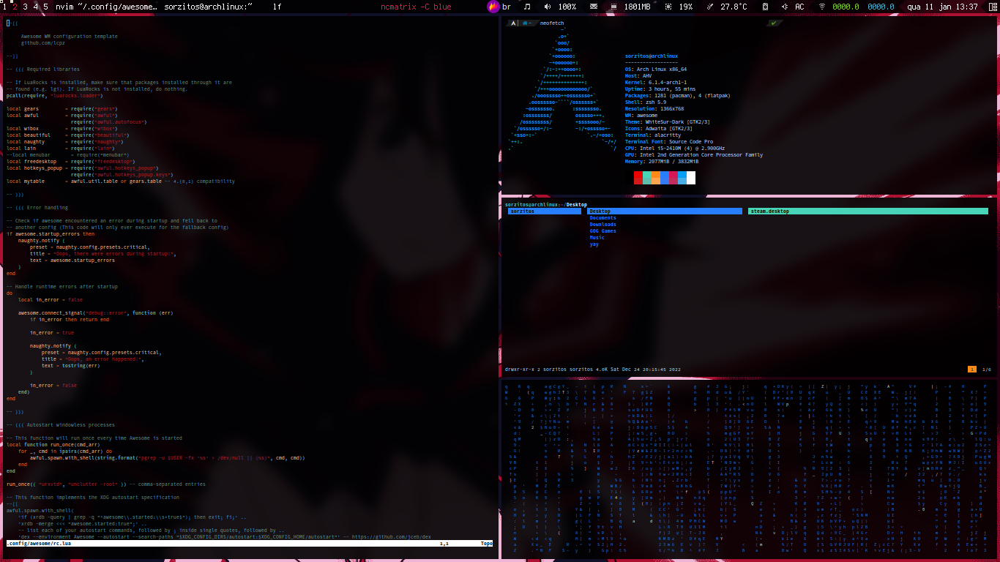
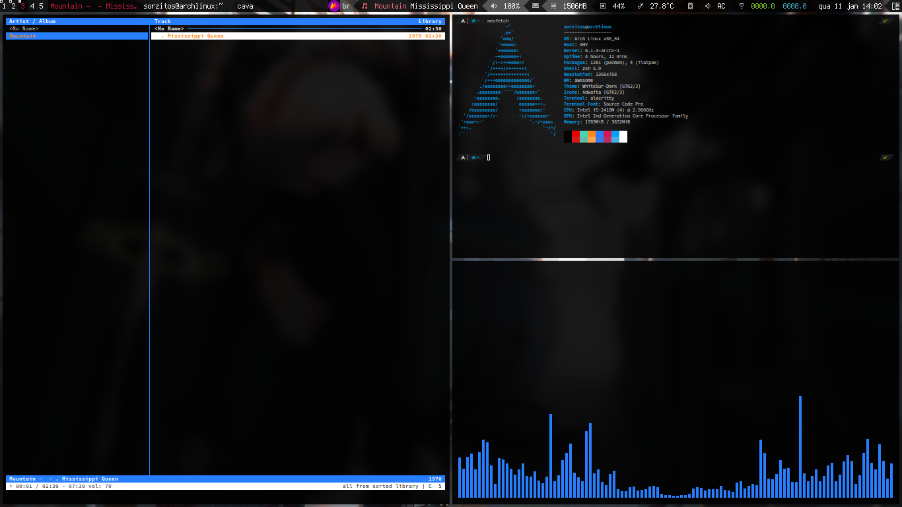
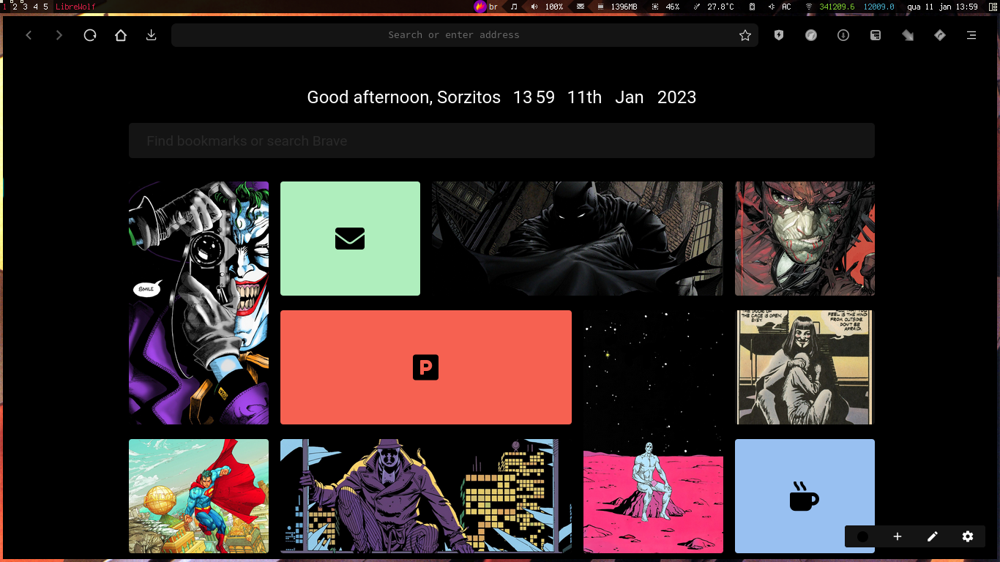

## Dotfiles
As the title and the description may suggests these are my fukcing dot files. If you are some kind of sadomasochist you can download them and make your own desktop look like shit too! How cool is that

**The good stuff:**
1. [Awesome WM](https://github.com/awesomeWM/awesome) config mainly stolen from [Awesome WM Copycats](https://github.com/lcpz/awesome-copycats)
2. [Alacritty](https://github.com/alacritty/alacritty) config mainly stolen from [Alacritty Theme](https://github.com/eendroroy/alacritty-theme)
3. [ZSH](https://www.zsh.org/) and [Oh My ZSH](https://ohmyz.sh/) config
4. OTHERS

### My Setup



```sh
                   -`                    sorzitos@archlinux
                  .o+`                   ------------------
                 `ooo/                   OS: Arch Linux x86_64
                `+oooo:                  Host: AHV
               `+oooooo:                 Kernel: 6.1.4-arch1-1
               -+oooooo+:                Uptime: 3 hours, 40 mins
             `/:-:++oooo+:               Packages: 1280 (pacman), 4 (flatpak)
            `/++++/+++++++:              Shell: zsh 5.9
           `/++++++++++++++:             Resolution: 1366x768
          `/+++ooooooooooooo/`           WM: awesome
         ./ooosssso++osssssso+`          Theme: WhiteSur-Dark [GTK2/3]
        .oossssso-````/ossssss+`         Icons: Adwaita [GTK2/3]
       -osssssso.      :ssssssso.        Terminal: alacritty
      :osssssss/        osssso+++.       Terminal Font: Source Code Pro
     /ossssssss/        +ssssooo/-       CPU: Intel i5-2410M (4) @ 2.900GHz
   `/ossssso+/:-        -:/+osssso+-     GPU: Intel 2nd Generation Core Processor Family
  `+sso+:-`                 `.-/+oso:    Memory: 1705MiB / 3832MiB
 `++:.                           `-/+/
 .`                                 `/
```
